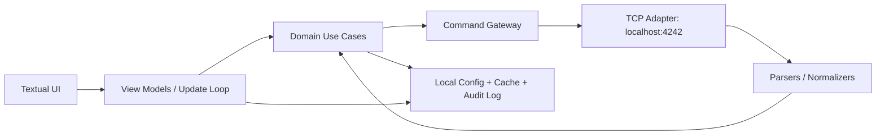
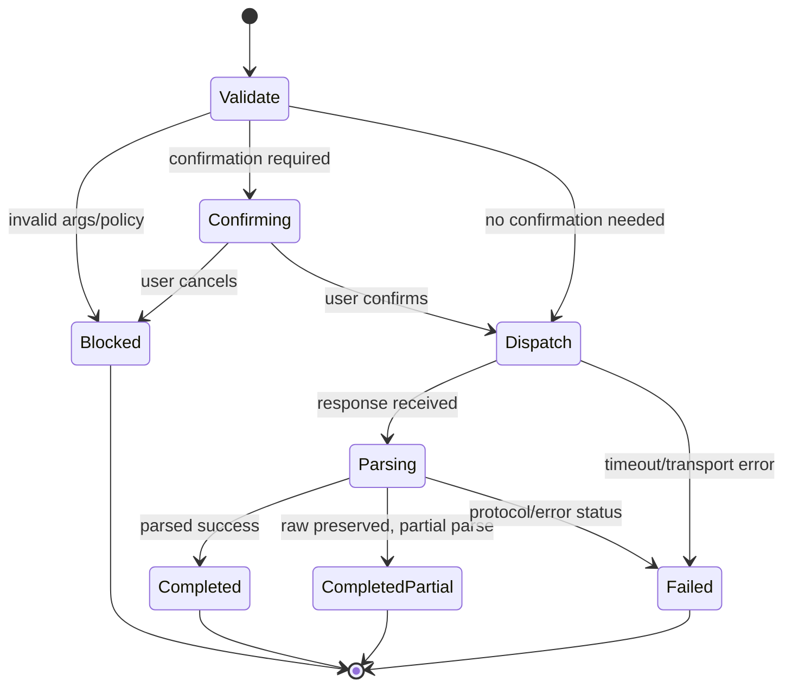
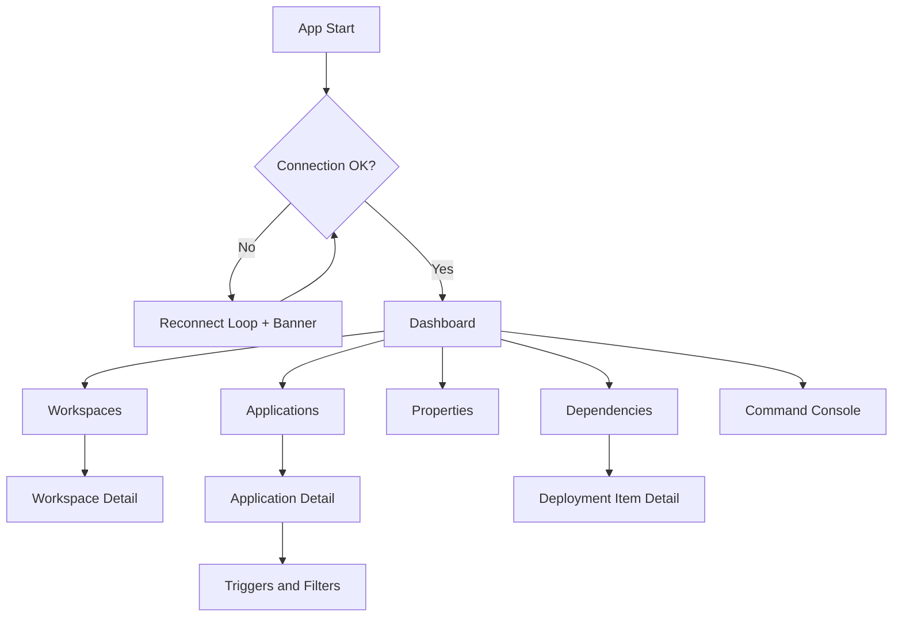

# Xyna TUI Design Document

## 1. Purpose and Scope

This document defines the design for a Linux-first terminal UI (TUI) application to operate Xyna Factory on the same host/container.

Out of scope for this document:
- Writing production code
- Replacing CI packaging automation with an in-app packaging subsystem
- Full command coverage of all Xyna CLI commands

In scope:
- Status view
- Workspace management
- Application management
- Xyna property management
- Dependency and deployment diagnostics that support the above

## 2. Inputs and Constraints

Primary source requirements:
- README defines four core domains: Status, Workspace Mgmt, Application Mgmt, Xyna Property Mgmt.
- Communication target is localhost:4242 using the protocol shown in docs/reference/factory-call.txt.
- Runtime target is Linux.
- Sample outputs in this repository define expected command output shapes and options.

Hard constraints:
- App must run in terminal-only environments (local shell, SSH, container shell, tmux/screen).
- App must tolerate command output variations (table, plain list, optional verbose fields).
- App must avoid destructive operations without explicit user confirmation.

## 3. Recommended Framework

### 3.1 Primary Recommendation: Python + Textual ecosystem

Recommended stack:
- Language: Python 3.11+
- TUI runtime: Textual
- Widgets and rendering: Textual built-in components (DataTable, Tree, Input, Modal, Footer/Header)
- CLI entrypoint: setuptools console script (`xyna-tui`) invoking `xyna_tui.app:run`

Why this is the best fit for this project:
- Python is already installed on target Linux systems.
- Rapid development for complex stateful terminal UIs.
- Strong ergonomics for parsing-heavy operational tools.
- Easier extensibility for custom diagnostics and audit pipelines.

Tradeoffs:
- Runtime dependency on Python environment.
- Packaging needs a Python distribution strategy (venv/wheel/pipx/container).

Current repository implementation note:
- CI packaging is handled separately through a GitHub Actions workflow that builds a one-file Linux binary artifact with PyInstaller.

### 3.2 Alternative A: Go + Bubble Tea

Pros:
- Single static binary and strong runtime performance.
- Good fit for highly optimized terminal apps.

Cons:
- Longer implementation cycle for equivalent feature depth.
- More custom UI plumbing for rich operator workflows.

### 3.3 Alternative B: Rust + Ratatui

Pros:
- Excellent performance and safety.
- Strong control over low-level behavior.

Cons:
- Highest implementation complexity and development effort.
- Slower team onboarding unless Rust expertise is already strong.

Decision:
- Use Python + Textual for v1.

## 4. High-Level Architecture

## 4.1 Layers

1. UI Layer
- Screen routing and view models.
- Keybindings, modal dialogs, notifications.

2. Domain Layer
- Use-cases: list workspaces, start/stop application, set property, show deployment details.
- Validation and guardrails for risky actions.

3. Gateway Layer
- Xyna command execution through direct TCP protocol client.
- Unified response envelope: stdout, stderr, exit status, parsed status token.

4. Parsing Layer
- Parsers for table mode and legacy text mode.
- Diagnostic parser for ENDOFSTREAM and status markers.

5. Persistence Layer (local app state)
- User preferences (refresh interval, default views, hidden columns).
- Optional action history cache.

## 4.3 Architecture Diagram

## 4.2 Command Transport Strategy

Transport policy for v1:
1. Built-in direct TCP protocol client only.
2. No runtime fallback to xynafactory.sh in v1.

Rationale:
- TCP-only removes shell coupling and keeps behavior deterministic.
- Direct protocol handling gives full control over retries, timeouts, and response mapping.
- Script fallback can be added later without changing UI/domain contracts.

Protocol details from sample:
- Group Separator (GS): 0x1D
- Record Separator (RS): 0x1E
- End Of Transmission (EOT): 0x04
- Return markers include:
  - ENDOFSTREAM_SUCCESS
  - ENDOFSTREAM_SUCCESS_BUT_NO_CHANGE
  - ENDOFSTREAM_REJECTED
  - ENDOFSTREAM_UNKNOWN_COMMAND
  - ENDOFSTREAM_XYNA_EXCEPTION
  - ENDOFSTREAM_COMMUNICATION_FAILED
  - ENDOFSTREAM_GENERAL_ERROR
  - Status-specific markers like ENDOFSTREAM_STATUS_UP_AND_RUNNING

Design decision:
- Normalize ENDOFSTREAM markers and transport errors into a single internal error model.

## 5. Core Functional Design

## 5.0 Command Coverage Matrix (v1)

Status and system:
- status
- uptime
- version
- listsysteminfo

Workspace management:
- listworkspaces [-t]
- createworkspace
- removeworkspace
- clearworkspace

Application management:
- listapplications [-t]
- startapplication
- stopapplication
- removeapplication

Property management:
- listproperties
- listproperties -v
- listproperties -vv
- get
- set

Diagnostics and context:
- listruntimecontextdependencies
- addruntimecontextdependency
- removeruntimecontextdependency
- changeruntimecontextdependencies
- showdeploymentitemdetails [-v]
- listwfs
- listdoms
- listexceptions
- listtriggers [-s]
- listfilters [-c]
- deploytrigger / undeploytrigger
- deployfilter / undeployfilter
- enabletriggerinstance / disabletriggerinstance
- enablefilterinstance / disablefilterinstance

## 5.0.1 Strict Command Validation Matrix (Implementation Contract)

Legend:
- Risk: Read | Write | Destructive
- Confirm: None | Soft | Typed
- Parser profile: Table | KV | Hierarchical | Text
- Normalized output: target DTO/entity expected by UI

Status and system commands:

| Command | Required args | Optional args | Risk | Confirm | Parser profile | Normalized output | Notes |
|---|---|---|---|---|---|---|---|
| status | none | -v | Read | None | Text/KV | FactoryStatusRecord | Map ENDOFSTREAM status markers to enum. |
| uptime | none | none | Read | None | KV/Text | UptimeRecord | Must parse start time and uptime duration. |
| version | none | none | Read | None | KV/Text | VersionRecord | Capture server and XMOM versions. |
| listsysteminfo | none | none | Read | None | Text | SystemInfoRecord | Large multiline parse; best-effort structured fields. |

Workspace commands:

| Command | Required args | Optional args | Risk | Confirm | Parser profile | Normalized output | Notes |
|---|---|---|---|---|---|---|---|
| listworkspaces | none | -t | Read | None | Table/Hierarchical | WorkspaceRecord[] | Prefer table parser, fallback to plain list. |
| createworkspace | -workspaceName | -revision | Write | Soft | Text | MutationResult | Validate name non-empty and safe charset. |
| removeworkspace | -workspaceName | -c, -f | Destructive | Typed | Text | MutationResult | Must display impact warning before execute. |
| clearworkspace | -workspaceName | -f, -removeSubtypesOf | Destructive | Typed | Text | MutationResult | Show blacklist-related caution from help semantics. |

Application commands:

| Command | Required args | Optional args | Risk | Confirm | Parser profile | Normalized output | Notes |
|---|---|---|---|---|---|---|---|
| listapplications | none | -t, -applicationName, -workspaceName, -v, -h | Read | None | Table/Hierarchical | ApplicationRecord[] | Default to -t when possible for stable parsing. |
| startapplication | -applicationName, -versionName | -c, -enableOrderEntrance, -f, -g | Write | Soft | Text | MutationResult | Validate target exists and is not already RUNNING when known. |
| stopapplication | -applicationName, -versionName | -disableOrderEntrance, -g | Write | Soft | Text | MutationResult | Validate target exists and is RUNNING when known. |
| removeapplication | -applicationName | -versionName, -f, -ff, -g, -parentWorkspace, -v, -c | Destructive | Typed | Text | MutationResult | Enforce STOPPED/AUDIT_MODE precheck when detectable. |

Property commands:

| Command | Required args | Optional args | Risk | Confirm | Parser profile | Normalized output | Notes |
|---|---|---|---|---|---|---|---|
| listproperties | none | -v, -vv, -showdoc, -p, -lang | Read | None | Text | PropertyRecord[] | Use streaming parser for -vv large outputs. |
| get | -key | -d, -lang, -p, -v | Read | None | KV/Text | PropertyDetailRecord | Preserve raw doc blocks. |
| set | -key, -value | -n, -g | Write | Soft (default) / Typed (when -g) | Text | MutationResult | Pre-show before/after value when available. |

Dependency and deployment diagnostics:

| Command | Required args | Optional args | Risk | Confirm | Parser profile | Normalized output | Notes |
|---|---|---|---|---|---|---|---|
| listruntimecontextdependencies | none | -applicationName, -versionName, -workspaceName, -t | Read | None | Hierarchical/Table | DependencyRecord[] | Build adjacency map for graph view. |
| addruntimecontextdependency | none (at least one owner and one requirement selector must resolve) | -ownerApplicationName, -ownerVersionName, -ownerWorkspaceName, -requirementApplicationName, -requirementVersionName, -requirementWorkspaceName, -f | Write | Soft | Text | MutationResult | UI must enforce owner and requirement completeness before dispatch. |
| removeruntimecontextdependency | none (at least one owner and one requirement selector must resolve) | -ownerApplicationName, -ownerVersionName, -ownerWorkspaceName, -requirementApplicationName, -requirementVersionName, -requirementWorkspaceName, -f | Destructive | Typed | Text | MutationResult | Typed confirmation required because dependency removals can break runtime resolution. |
| changeruntimecontextdependencies | -changes | -ownerApplicationName, -ownerVersionName, -ownerWorkspaceName, -f | Destructive | Typed | Text | MutationResult | Parse and preview each change token (a: / r:) before execute. |
| showdeploymentitemdetails | -objectName | -applicationName, -versionName, -workspaceName, -v | Read | None | KV/Hierarchical | DeploymentItemRecord | Verbose mode parses SAVED/DEPLOYED interface sections. |
| listwfs | none | -applicationName, -versionName, -workspaceName | Read | None | Text | DeploymentSummaryRecord[] | Parse deployment status per workflow. |
| listdoms | none | -applicationName, -versionName, -workspaceName | Read | None | Text | NameListRecord[] | Datatype list output. |
| listexceptions | none | -applicationName, -versionName, -workspaceName | Read | None | Text | NameListRecord[] | Handle empty-state message explicitly. |

Trigger and filter commands:

| Command | Required args | Optional args | Risk | Confirm | Parser profile | Normalized output | Notes |
|---|---|---|---|---|---|---|---|
| listtriggers | none | -s, -i, -r, -v, -e, -o | Read | None | Table | TriggerRecord[] / TriggerInstanceRecord[] | With -s include start parameter table. |
| listfilters | none | -c, -i, -r, -v, -e, -o | Read | None | Table | FilterRecord[] / FilterInstanceRecord[] | With -c include config parameter table. |
| deploytrigger | -triggerInstanceName, -triggerName | -applicationName, -versionName, -workspaceName, -startParameters, -v | Write | Soft | Text | MutationResult | Validate required identifiers and start parameters format. |
| undeploytrigger | -triggerInstanceName, -triggerName | -applicationName, -versionName, -workspaceName, -v | Destructive | Typed | Text | MutationResult | Warn about cascading filter undeploy side effects. |
| enabletriggerinstance | -triggerinstancename | -applicationName, -versionName, -workspaceName, -d, -orderentrancelimit, -v | Write | Soft | Text | MutationResult | Name is lowercase in help; keep exact CLI flag. |
| disabletriggerinstance | -triggerinstancename | -applicationName, -versionName, -workspaceName, -d, -v | Write | Soft | Text | MutationResult | No typed confirmation required by default. |
| deployfilter | -filterInstanceName, -filterName, -triggerInstanceName | -applicationName, -versionName, -workspaceName, -configurationParameter, -documentation, -o, -v | Write | Soft | Text | MutationResult | Validate trigger instance exists if cached view available. |
| undeployfilter | -filterInstanceName | -applicationName, -versionName, -workspaceName, -v | Destructive | Typed | Text | MutationResult | Typed confirm because operational traffic impact possible. |
| enablefilterinstance | -filterinstancename | -applicationName, -versionName, -workspaceName, -v | Write | Soft | Text | MutationResult | Keep exact lowercase flag from CLI help. |
| disablefilterinstance | -filterinstancename | -applicationName, -versionName, -workspaceName, -v | Write | Soft | Text | MutationResult | Keep exact lowercase flag from CLI help. |

Validation rules (apply to all commands):
- Reject execution if required args are missing.
- Reject execution if mutually exclusive UI toggles are set (future-proof guard).
- Sanitize user-provided values for control characters except expected whitespace.
- Persist full command envelope and response metadata to audit log for Write/Destructive operations.
- Preserve raw response for parser failures and mark parser_status=partial.

Confirmation policy contract:
- Soft confirmation: explicit modal with action summary and target.
- Typed confirmation: user must type exact target identifier, e.g. workspace or application name.
- Multi-target destructive operations require typed token DELETE-ALL plus count preview.

Timeout and retry contract:
- Reads: timeout 10s, one automatic retry for transport failures only.
- Writes/Destructive: timeout 30s, no automatic retry.
- Retries are forbidden for commands with side effects unless idempotency is proven.

Command execution state machine:

## 5.1 Global Navigation

Primary nav items:
- Dashboard
- Workspaces
- Applications
- Properties
- Dependencies
- Deployment Items
- Triggers & Filters
- Command Console

Global UX conventions:
- Top bar: connection status, target endpoint, last refresh, active workspace/application context.
- Bottom bar: key hints (Refresh, Search, Filter, Actions, Help, Quit).
- Command palette for fast navigation and actions.

Default keybindings (proposed):
- g d: go to Dashboard
- g w: go to Workspaces
- g a: go to Applications
- g p: go to Properties
- g r: go to Dependencies
- /: search in current table
- f: open filter panel
- r: manual refresh
- a: open action menu for selected row
- Enter: open details
- c: open command console
- ?: help overlay
- q: back/close
- Ctrl+c: quit application

## 5.2 Dashboard (Status)

Data sources:
- status
- uptime
- version
- listsysteminfo

Widgets:
- Factory state (Up, Starting, Stopping, Not Running)
- Uptime and start time
- Xyna server version and XMOM version
- Host info (OS, CPU summary, memory summary)
- Last command latency and recent error count

Refresh policy:
- Poll every configurable interval (default 5s).
- Backoff on connection failures.

Failure UX:
- Non-blocking warning toast for transient failures.
- Persistent banner when connection is lost.
- Automatic reconnect attempts with visible countdown.

## 5.3 Workspace Management

Data sources:
- listworkspaces [-t]
- createworkspace
- removeworkspace
- clearworkspace
- listruntimecontextdependencies (workspace slice)

Main table columns:
- Name
- Revision
- Status
- Problems
- Requirements

Actions:
- Create workspace
- Remove workspace
- Clear workspace
- Inspect dependency graph
- Inspect related deployment problems

Safety rules:
- Remove/Clear require confirmation modal with explicit typed confirmation.
- Force flags exposed only in advanced mode.

Row details panel:
- Runtime context dependencies for selected workspace.
- Quick problem summary from listworkspaces Problem count.
- Shortcut to deployment item search scoped by workspace.

Implemented interaction update:
- `i` opens a modal with split-pane navigable tables:
  - Summary table (state, dependency count)
  - Runtime-context dependency table
  - Content-types table (`WORKFLOW`, `DATATYPE`, `EXCEPTION`, `TRIGGER`, `FILTER`)
  - Content-items table synchronized with selected content type
- `Tab` and `Shift+Tab` cycle keyboard focus between all detail tables.
- `o` opens object picker before running object-level dependency tree.

## 5.4 Application Management

Data sources:
- listapplications [-t]
- startapplication
- stopapplication
- removeapplication
- listruntimecontextdependencies

Main table columns:
- ApplicationName
- VersionName
- Workspace
- Status
- Objects
- Revision

Actions:
- Start application
- Stop application
- Remove application
- Show dependency tree
- Jump to triggers/filters scoped to selected runtime context

State handling:
- Enforce valid transitions in UI (for example disable Start when already RUNNING).

Bulk actions:
- Multi-select STOPPED applications -> start selected.
- Multi-select RUNNING applications -> stop selected.
- Mixed state selection splits into valid and invalid subsets with clear feedback.

Implemented interaction update:
- `i` opens an application details modal with navigable table panes:
  - Runtime-context dependency table (separate from content)
  - Sections table (WORKFLOW, DATATYPE, EXCEPTION, etc.)
  - Section-items table synchronized with selected section row
  - Order-entry-interfaces table
- `Tab` and `Shift+Tab` cycle focus between panes for keyboard-only navigation.

## 5.5 Xyna Property Management

Data sources:
- listproperties
- listproperties -v
- listproperties -vv
- get
- set

Views:
- Compact properties (name + reader usage)
- Detailed values view
- Extended defaults view (lazy loaded due to large output)

Actions:
- Get property details and documentation
- Set property value
- Set only if unset (-n)
- Optional global set (-g) with strong warning

Usability features:
- Property search with fuzzy matching.
- Reader/Unused filters.
- Value diff preview before apply.

Edit safety:
- Validate property key existence before set unless user forces custom key mode.
- Show current value and default value side by side before confirmation.
- Warn when using global set flag.

## 5.6 Dependencies and Deployment Diagnostics

Data sources:
- listruntimecontextdependencies
- addruntimecontextdependency
- removeruntimecontextdependency
- changeruntimecontextdependencies
- showdeploymentitemdetails [-v]
- listwfs, listdoms, listexceptions

Views:
- Dependency graph/tree for runtime contexts.
- Deployment item inspector with SAVED vs DEPLOYED interfaces.
- Cross-links to owning workspace/application.

Actions:
- Add runtime context dependency.
- Remove runtime context dependency.
- Change runtime context dependencies using atomic change-set editor.
- Dry-run style preview of dependency mutation request before dispatch.

Dependency graph interactions:
- Expand/collapse dependency tree.
- Detect and annotate cycles if found.
- Jump from dependency node to related application/workspace row.
- Open mutation modal prefilled from selected owner/requirement nodes.

Implemented interaction update:
- `d` opens runtime-context dependency tree for selected workspace/application row with cycle markers.
- `o` opens object-level dependency tree for selected workspace/application:
  - Workflow auto-discovery via `listwfs` scoped to selected runtime context
  - Dependency retrieval via `printdependencies -r`
  - Tree rendering from parsed dependency-depth lines.

## 5.7 Trigger and Filter Operations

Data sources:
- listtriggers [-s]
- listfilters [-c]
- deploytrigger / undeploytrigger
- deployfilter / undeployfilter

Views:
- Trigger inventory and instance state.
- Filter inventory, attached trigger instance, optionality, config parameters.

Actions:
- Deploy/undeploy trigger and filter instances.
- Enable/disable trigger and filter instances.
- Show configuration/start parameter details before apply.

## 5.8 Command Console (Power User)

Purpose:
- Controlled raw command execution with parser-aware rendering.

Capabilities:
- Command history.
- Save favorite commands.
- Structured result pane with status token and output body.

Safety:
- Destructive command detection with confirmation.

Rendering behavior:
- Auto-detect table output and render as interactive grid when possible.
- Fallback to scrollable text viewport with copy support.
- Highlight ENDOFSTREAM marker and mapped semantic status.

## 5.9 Screen Flow Diagram

## 6. Missing but Useful Features to Add

1. Connection Profiles
- Multiple targets (host, port, transport mode) with secure local storage.

2. Role-based Action Modes
- Read-only mode and operator mode to reduce accidental changes.

3. Dry-run/Preview Layer
- For mutating commands, show exact command and expected target before execution.

4. Audit Trail Export
- Session action log export to JSON or text for change tracking.

5. Health Alerts
- Threshold alerts on repeated failures, status flapping, or increasing WARNING/Problems counts.

6. Offline Snapshot Mode
- Cache latest successful outputs; allow browsing when Xyna is down.

7. Bulk Operations
- Multi-select start/stop for applications, bulk property updates with guarded workflow.

8. Explain Errors
- Curated hints for common failures (connection refused, unknown command, rejected action).

9. Diff Views
- Before/after comparison for properties and selected list views after actions.

10. Accessibility and Keyboard Profiles
- Vim-like optional keymap, high-contrast theme, configurable keybindings.

## 7. Data Parsing and Normalization

Parsing requirements:
- Support table output with box drawing characters.
- Support plain text list output.
- Detect command prompt echoes and strip them from parsed records.
- Parse multiline sections (for example showdeploymentitemdetails verbose blocks).
- Parse very large outputs incrementally (listproperties -vv).

Parsing strategy:
- First pass: strip shell prompt lines and control artifacts.
- Second pass: detect output family (table, key-value, hierarchical list, free text).
- Third pass: map to typed record structures.
- Final pass: attach metadata (timestamp, command, parser confidence, fallback used).

Fallback rules:
- If table parsing fails, retry as plain text parser.
- If typed parsing fails, preserve raw output and classify as unstructured success/error.
- Never discard raw output.

Normalization model examples:
- WorkspaceRecord: name, revision, status, problemCount, requirementCount
- ApplicationRecord: name, version, workspace, status, objectCount, revision
- PropertyRecord: name, value, defaultValue, readers[], unused
- DependencyRecord: ownerContext, requiredContext
- DeploymentItemRecord: type, name, runtimeContext, state, publishedInterfaces, usedInterfaces

Error model:
- ConnectionError
- CommandRejected
- UnknownCommand
- ValidationError
- NoChange
- InternalUnexpected

## 8. Concurrency and Performance

Execution model:
- Command queue with cancellation tokens.
- Per-view refresh workers.
- Debounced search/filter operations.

Performance goals:
- Initial dashboard paint: <= 1.5s after start (healthy local factory).
- View refresh completion for moderate outputs: <= 2s.
- Property extended list rendering with virtualized scrolling.

Command timeout policy:
- Default timeout 10s for read operations.
- Default timeout 30s for write operations.
- User-configurable per command group.
- Timeout returns cancellable error state with quick retry.

## 9. Security and Safety

- No remote code execution beyond intended Xyna CLI command surface.
- Input sanitization for command arguments (especially property values and object names).
- Confirmations for destructive operations with explicit target details.
- Configurable sensitive value masking in UI and logs.
- Optional command allowlist mode for hardened environments.

## 10. Observability

Local app telemetry (file-based, opt-in):
- Command latency
- Failure rates by command
- Parser fallback rates (table parser -> text parser)
- UI crash diagnostics

Logs:
- Structured JSON logs with rotation.
- Mandatory timestamped audit log for all mutating actions.

Standard Linux/XDG locations:
- Config: $XDG_CONFIG_HOME/xyna-tui/config.toml (fallback ~/.config/xyna-tui/config.toml)
- State: $XDG_STATE_HOME/xyna-tui/ (fallback ~/.local/state/xyna-tui/)
- Audit log: $XDG_STATE_HOME/xyna-tui/audit-YYYY-MM-DD.log
- App log: $XDG_STATE_HOME/xyna-tui/app.log

## 11. Testing Strategy

Test layers:
- Unit tests for parsers using sample files in this repo.
- Contract tests for command execution adapter using recorded fixtures.
- Integration tests with a mock CLI process.
- Optional end-to-end tests against test Xyna instance in CI (Linux container).

Key test scenarios:
- Connection refused handling.
- ENDOFSTREAM variant mapping.
- Parsing of large listproperties -vv output.
- Status transitions under rapid refresh.
- Confirmation workflow prevents accidental destructive execution.

Acceptance criteria examples:
- listapplications -t parser extracts all rows and columns from sample output.
- listworkspaces plain and table outputs both map to identical normalized records.
- showdeploymentitemdetails -v parser captures both published and used interfaces.
- Mutation command failures surface actionable messages in less than 1 second after command return.

## 12. Delivery Plan (Design-Level)

Implementation strategy:
- Deliver one complete v1 scope (no pre-publish staging) with internal milestones.

Milestone A:
- TCP protocol client, parser core, dashboard, workspace/application/property read views.

Milestone B:
- All mutating operations with confirmations and mandatory timestamped audit logging.

Milestone C:
- Dependencies, deployment item diagnostics, full trigger/filter deployment and enable/disable workflows.

Milestone D:
- Performance hardening, packaging, operator acceptance.

Final v1 exit criteria:
- All core features in this document are implemented and tested.
- Audit logs are present for all mutating actions.
- Linux package/install path is validated on target systems.

## 13. Linux Packaging and Runtime

Target artifacts:
- Python wheel package.
- Optional pipx-compatible install.
- Optional minimal container image.

Runtime dependencies:
- Python 3.11+.
- No mandatory dependency on xynafactory.sh in v1.

Configuration locations:
- XDG config directory for user settings.
- XDG state/log directories for cache and logs.

## 14. Resolved Decisions

1. Implementation stack:
- Python + Textual.

2. Transport:
- Direct TCP is default and only mode in v1.

3. v1 scope:
- Full scope in v1, including trigger/filter management.

4. Release approach:
- No pre-publish staging required; complete v1 delivery.

5. Localization:
- English output only for now.

6. Auditing:
- Mandatory timestamped audits on standard Linux/XDG paths.

## 15. Implementation Readiness Checklist

Before coding starts, this checklist must be all Yes:
- Framework and language confirmed: Yes.
- Transport mode policy confirmed: Yes.
- v1 feature scope frozen: Yes.
- Safety policy for destructive operations approved: Yes.
- Logging and persistence paths approved: Yes.
- Linux packaging target agreed: Yes.
- Open questions resolved: Yes.

The checklist is complete. The design is ready for implementation.

## 16. Final v1 Baseline

v1 includes:
- Dashboard, Workspaces, Applications, Properties, Dependencies, Deployment Items, Triggers and Filters, Command Console.
- Read and write operations with typed confirmations for destructive actions.
- Runtime context dependency mutation (add/remove/change) with pre-execution preview.
- TCP protocol transport.
- English parser profiles.
- Mandatory timestamped audit logging in XDG standard locations.

Future option (post-v1):
- Add xynafactory.sh transport adapter as optional fallback without changing user-facing workflows.
